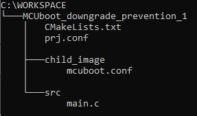
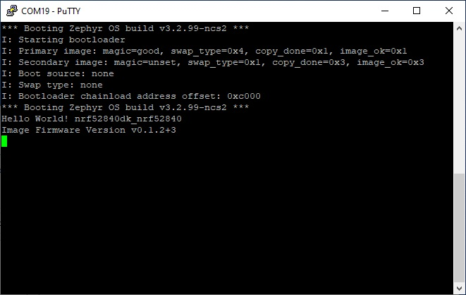
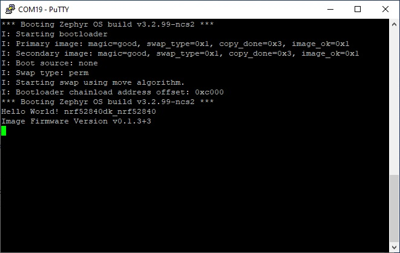
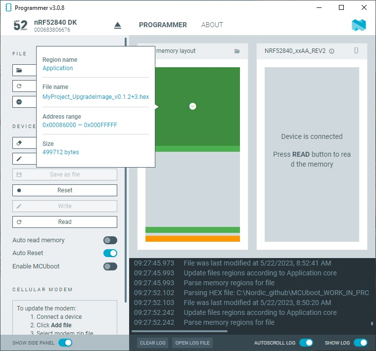
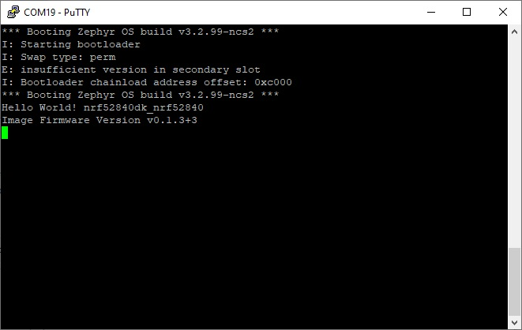

SDK version: NCS v2.3.0 - Link to Hands-on solution: [TBD](https://github.com/ChrisKurz/MCUboot/tree/main/Workspace/NCSv2.3.0/)

# MCUboot Hands-on:  Using Software-based Downgrade Protection 

## Introduction

Downgrade prevention is a feature which enforces that the new image must have a higher version or security counter number than the image it is replacing, thus preventing the malicious downgrading of the device to an older and possibly vulnerable version of its firmware. MCUBoot provides two methods to realize a downgrade prevention:

- Software-based downgrade prevention:

   During the software based downgrade prevention the image version numbers are compared. This method is only available for the image upgrade mode _Overwrite image updates_ (CONFIG_BOOT_UPGRADE_ONLY=y).
   
- Hardware-based downgrade prevention:

   During the hardware-based downgrade prevention (alias rollback protection) the new image’s security counter will be compared with the currently active security counter value which must be stored in a non-volatile and trusted component of the device. 

In this hands-on we will take a look on the software-based downgrade prevention.

## Required Hardware/Software for Hands-on
- one nRF52 development kit (e.g. nRF52DK, nRF52833DK, or nRF52840DK)
- install the _nRF Connect SDK_ v2.3.0 and _Visual Studio Code_. The description of the installation can be found [here](https://developer.nordicsemi.com/nRF_Connect_SDK/doc/2.3.0/nrf/getting_started/assistant.html#).

## Hands-on step-by-step description 

### Create new project

1) Copy the [MCUboot2](https://github.com/ChrisKurz/MCUboot/tree/main/Workspace/NCSv2.3.0/01_MCUboot2) project and rename the folder name to "MCUBoot_downgrade_prevention_1". Open the project and add build configuration.

2) To see which upgrade image version is executed when doing the testing, we change the printed text to the following:

	_src/main.c_ => main() function

           printk("Image Firmware Version v%s \n", CONFIG_MCUBOOT_IMAGE_VERSION);

### Use _Permanent_ Swap Type

3) For our testing it is easier to use _permanent_ swap type. So with following KCONFIG we select this swap type. 

	_prj.conf_

       # Confirm the upgrade image. This causes to use swap type "permanent"
       CONFIG_MCUBOOT_EXTRA_IMGTOOL_ARGS="--confirm"

### Define Version Number of own Software

4) We have to define the version number of our software by adding following KCONFIG symbol to the project's __prj.conf__ file. 
 
	_prj.conf_

       CONFIG_MCUBOOT_IMAGE_VERSION="0.1.2+3"      
 
   This version number has always the same format:
   
      __maj__.__min__.__rev__+__build__
   
      - __maj__ is major revision number
      - __min__ is minor revision number (optional)
      - __rev__ is revision number (optional)
      - __build__ is build number (optional)   => Note that the build number is not checked for downgrade prevention! 
      

### Enable Downgrade Prevention in MCUBoot

5) The settings regarding downgrade prevention must be made for MCUBoot. Since we have activated a multi-image build in our project via CONFIG_BOOTLOADER_MCUBOOT=y, we can create a mcuboot.conf file in the __child_image__ directory that will be used for overwritting the settings for MCUBoot. Let's create the __child_image__ folder and create a file __mcuboot.conf__ in this folder. So the project folder structure should look like this:

   

   NOTE: Please note that the folder name has to use the name __child_image__ and the config file name has to be __mcuboot.conf__!

6) Enabling the software-based downgrade prevention is done by adding following lines to mcuboot.conf file:

	_child_image/mcuboot.conf_

       CONFIG_BOOT_UPGRADE_ONLY=y        
       CONFIG_MCUBOOT_DOWNGRADE_PREVENTION=y

   NOTE: The software-based downgrade prevention requires the overwrite image update mode. This mode does not allow a swap back in case issues are seen after an overwrite! 

7) Build the project.

## Testing

### Prepare the test files

8) Copy the file _merged.hex_ from the _build/zephyr_ folder to a place where you will find it. 
9) Renamce the merged.hex file into _ MyProject_v0.1.2+3.hex_.
10) Copy also the file  _app_moved_test_update.hex_ and rename it with _MyProject_UpgradeImage_v0.1.2+3.hex_.
11) Change the version number by updating in the prj.conf the CONFIG_MCUBOOT_IMAGE_VERSION string:

	_prj.conf_

        CONFIG_MCUBOOT_IMAGE_VERSION="0.1.3+3"
       
12) build the project
13) Copy the file _app_moved_test_update.hex_ to the same folder as the file before.
14) Rename this file to _MyProject_UpgradeImage_v0.1.3+3.hex_.

### Tests
#### Download MCUBoot + orignial application
15) Do a __Erase All__ in the Programmer tool. 
16) Program the _MyProject_v0.1.2+3.hex_ file on your board by clickinng on __Erase & Write__ button.

      

   NOTE: You can see two parts here. The orange block is the MCUboot bootloader, the green block is the user application. MCUboot was placed in the MCUBoot partition, the user software was placed in the SLot_0 (primary slot). 

17) Start a terminal program on the computer and check the serial logging output of the development kit.

      

#### Download Upgrade Image v0.1.3+3 (previous firmware stays there)
18) Now, use the programmer app on your computer and add the _MyProject_UpgradeImage_v0.1.3+3.hex_ file. Do not remove the previously loaded image (_MyProject_v0.1.2+3.hex_). Click on __Erase & Write__. Ensure that terminal program is still running. 

      

   NOTE: You can still see the previously programmed software (mcuboot and user application). In addition, we now also see the upgrade image that was placed in slot 1 (secondar slot). The upgrade image contains OpCode for the complete slot 1 memory. Also not used addresses were mentioned here with 0xFFFF FFFF. Because these unused addresses were mentioned with the default value in the upgrade HEX file, the complete flash block is marked in the programmer tool as to be updated. 

19)  Start a terminal program on the computer and check the serial logging output of the development kit.

      

#### Download Upgrade Image v0.1.2+3 (previous firmware stays there)

20) Remove all images from the programmer's _File memory layout_. Add the _MyProject_UpgradeImage_v0.1.2+3.hex_ file and _MyProject_v0.1.3+3_. Click the __Erase & Write__ button. Ensure that terminal program is still running. 

      

   NOTE: In SLot-0 we have our software version 0.1.3+3. In Slot-0 we have Software version 0.1.2+3 loaded. So this would be aFirmware downgrade. However, the downgrade prevention is activated!

21)  Start a terminal program on the computer and check the serial logging output of the development kit.

      

