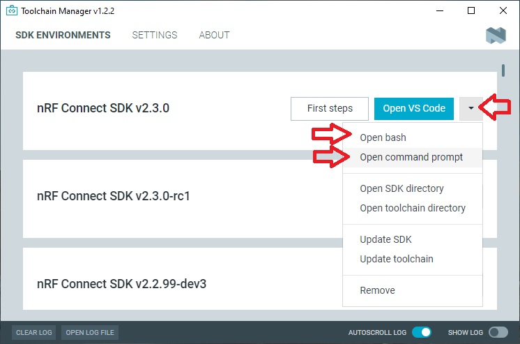

SDK version: NCS v2.3.0

# Generate a Key File

## Introduction 

MCUboot uses a signature for the application images. This means that each application image receives a signing key that is used to authenticate the image. This ensures that only authenticated software is executed. In addition, keys are used to encrypt an image when needed. 

In this hands-on we will look at the creation of a key file required for these purposes. 

## Required Software
- install the _nRF Connect SDK_ v2.3.0 and _Visual Studio Code_. The description of the installation can be found [here](https://developer.nordicsemi.com/nRF_Connect_SDK/doc/2.3.0/nrf/getting_started/assistant.html#).

## Hands-on step-by-step description 

### Generate the key file
First, we generate a PEM file that contains a private/public key pair. The developers of MCUBoot provide a tool for image signing, image encryption, and key management. This tool is called __imgtool__. The __imgtool__ is included in the MCUBoot repository. This means that when you install the _nRF Connect SDK_, you also install MCUBoot and the __imgtool__ included in it. Note that __imgtool__ is a command line tool, which is executed in a command shell.

The easiest way to use __imgtool__ is via _bash_ or _command prompt_, which can be started in the _Toolchain Manager_. So, open _nRF Connect for Desktop_ and start the _Toolchain Manager_. Then click on the button with the arrow, which opens a context menu. Here you can start either _bash_ or _command prompt_.

## Generating a PEM file...

There are different tools that help to create a PEM file. Here we will use __imgtool__.

The imgtool can be used to generate rsa-2048, rsa-3072, ecdsa-p256, ed25519, and x25519 keys. Here is the instruction:

    imgtool keygen -k <filename> -t <type> [-p]

|OPTIONS:|  |
|--|--|
| -k < filename > | This file will be generated and it contains the keypair. (example: -k my-key.pem)  |
| -p  | Adding this argument will cause to prompt for a password. You will need to enter this password every time you use the private key. No password is used in case you will not mention this argument. |
| -t < type >     | Key type. It should match what mcuboot is configured to verify. (example: -t rsa-2048) |

| Possible types are: | 
|--| 
| rsa-2048   | 
| rsa-3072   |
| ecdsa-p256 |
| ecdsa-p224 |
| ed25519    |
| x25519     |
 
Example:

Enter following line:

    imgtool keygen -k My_Key.pem -t ecdsa-p256

The file _My_Key.pem_ is created and it looks like this:

