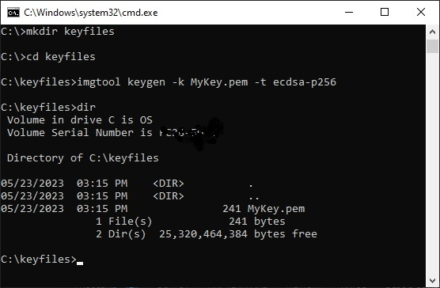
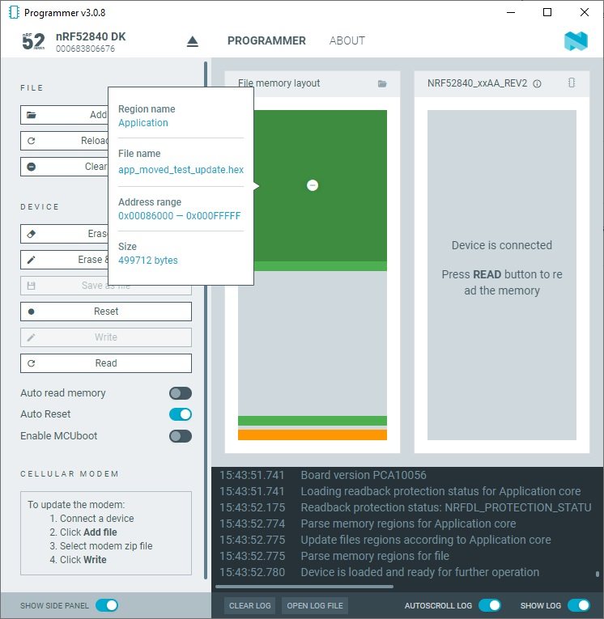
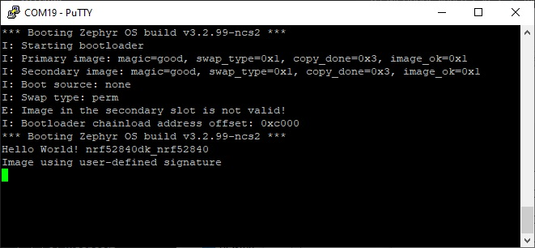

SDK version: NCS v2.3.0 - Link to Hands-on solution: [03_MCUboot_signed](https://github.com/ChrisKurz/MCUboot/tree/main/Workspace/NCSv2.3.0/03_MCUboot_signed)

# Create a signed Application Image using Signature Type _Elliptic curve digital signatures with curve P-256_

## Introduction
The toolchain is supporting the generation of a signed application image. This is done by setting CONFIG_BOOTLOADER_MCUBOOT=y in your project. Setting this CONFIG causes a multi-image build including the MCUboot project. Moreover the build process generates different intel hex and binary files. Different levels of application images are generated, e.g. application image only, signed application image, merged application and mcuboot image, ... .

After building the project you find following files in the build/zephyr directory:

- __app_update.bin__: Signed variant of the firmware in binary format (as opposed to intelhex). This file can be uploaded to a server as FOTA image.
- __app_to_sign.bin__: Unsigned variant of the firmware in binary format.
- __app_signed.hex__: Signed variant of the firmware in intelhex format. This HEX file is linked against the same address as the application. Programming this file to the device will overwrite the existing application. It will not trigger a DFU procedure.
- __app_test_update.hex__: Same as app_signed.hex except that it contains metadata that instructs MCUboot to test this firmware upon boot. As app_signed.hex, this HEX file is linked against the same address as the application. Programming this file to the device will overwrite the existing application. It will not trigger a DFU procedure.
- __app_moved_test_update.hex__:  Same as app_test_update.hex except that it is linked against the address used to store the upgrade candidates. When this file is programmed to the device, MCUboot will trigger the DFU procedure upon reboot.
          
Note that if you do not care about the signature of the image, the MCUboot's default keys is used. This key is publicly known! You also get a warning in the terminal output, when you build your project using the default key. 

On the top in above picture you see the used _MCUBoot bootloader key file_. The default keys are located in the folder:
   <nRF Connect SDK install path>/bootloader/mcuboot/
The default file here is __root-ec-p256.pem__, because the _Elliptic curve digital signatures with curve P-256_ is the default selection for the signature type. In case another signature type would be selected, there are appropriate default key files that would be used in case you have not defined your own. 

Let's generate an own key file and sign an application image.
  
## Required Hardware/Software for Hands-on
- one nRF52 development kit (e.g. nRF52DK, nRF52833DK, or nRF52840DK)
- install the _nRF Connect SDK_ v2.3.0 and _Visual Studio Code_. The description of the installation can be found [here](https://developer.nordicsemi.com/nRF_Connect_SDK/doc/2.3.0/nrf/getting_started/assistant.html#).

## Hands-on step-by-step description 

### Generate the Key File
1) Let's generate a key file. 
          
   Name your PEM file: __MyKey.pem__
          
   Used Key Type:   __ecdsa-p256__

   __NOTE__: This step-by-step description is using a PEM file without a password!          
          
   Open the _command prompt_ or _bash_ and enter following instruction:

   a) create a folder where you will store your key files, e.g. c:/keyfiles).          
   b) Go to the new folder and then use __imgtool__ and generate the PEM file. 
          
       imgtool keygen -k MyKey.pem -t ecdsa-p256

               
          
      __IMPORTANT__: This PEM file should be kept confidential and access should be allowed only to authorized persons. With this file you can create signed/authenticated application images. 

   Further information about generation of a key file can be found [here](https://github.com/ChrisKurz/MCUboot/blob/main/doc/NCSv2.3.0_GenerateKey.md). 
   
   

          
### Create new project
2) We use [MCUBOOT2_confirmed project](https://github.com/ChrisKurz/MCUboot/tree/main/Workspace/NCSv2.3.0/01a_MCUboot2_confirm). Make a copy of this project and rename the folder to __03_MCUboot_signed__. And update the printk text to:

   _src/main.c_          

           printk("Image using user-defined signature \n"); 	

          
3) Add _Build Configuration_ and select the development kit you are using. 

### Add the key to MCUboot
4) Add the folder __child_image__ to your project. 

5) Add the file __mcuboot.conf__ into the __child_image__ folder. And add following lines to __mcuboot.conf__ file:
          
   _child_image/mcuboot.conf_
   
       # MCU<boot PEM key file
       CONFIG_BOOT_SIGNATURE_KEY_FILE="c:/keyfiles/MyKey.pem"
          
### Add the key to your project (Application Image)
6) Selection of CONFIG_BOOT_SIGNATURE_KEY_FILE in MCUboot configuration is also used for Application image! There is no need to set something else!
                  
### Build the project
7) Build the project. 
 
   You should see that the warning "Using default MCUboot key" is not shown anylonger. Moreover, the new keyfile is mentioned in the terminal output. 
                  
   
                  
## Testing
8) Start a terminal program and connect to your development kit.
9) Use the Programmer tool and add the images __merged.hex__ and __app_moved_test_update.hex__. Then click on "Erase & Write".

   NOTE: these images can also be found in the solution project folder in the folder "HEX Files". The files are named "merged_USER-DEFINED-KEY.hex" and "app_moved_test_update_USER-DEFINED-KEY.hex". 

   

10) You can see in the terminal that a permanent swap is done. The upgrade image is accepted and moved to slot-0. Then it is executed. 
                  
   

11) You can use the orignial [MCUboot2_confirmed](https://github.com/ChrisKurz/MCUboot/tree/main/Workspace/NCSv2.3.0/01a_MCUboot2_confirm) upgrade image (app_moved_test_update.hex) and check if this one is accepted. Note that this one uses the default key! When it is executed it should output "Image: MCUboot2 (confirmed)" on the terminal. 
 
   NOTE: I have put this hex file also in the _HEX Files_ folder in this project. The name of this file is "app_moved_test_update_DEFAULT-KEY.hex".
                  
   

   __NOTE__: As you can see, the image that uses the default key is not accepted. The default key software would output "Image: MCUboot2 (confirmed)" in the terminal. Instead, the old image with the correct signature is executed. Please note also that the invalid image is erased. Try to use Programmer tool and click the __Read__ button. 
