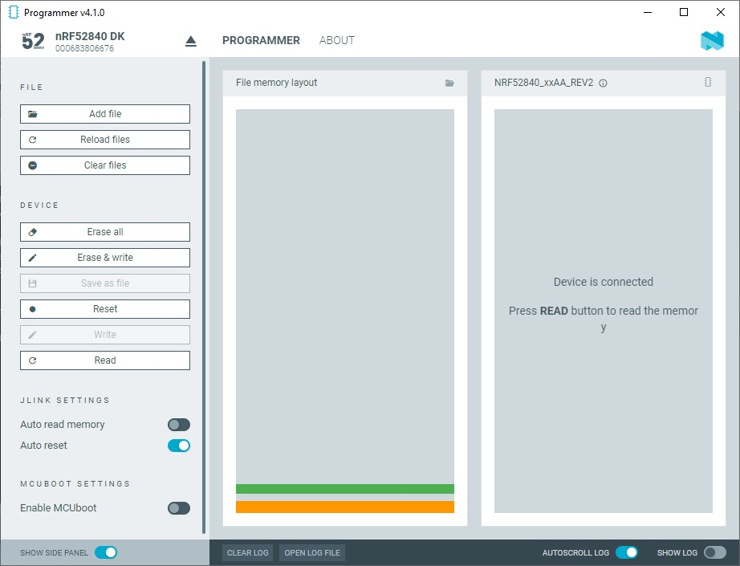
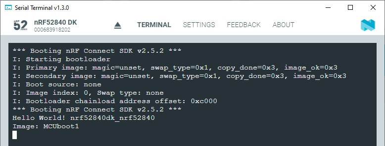
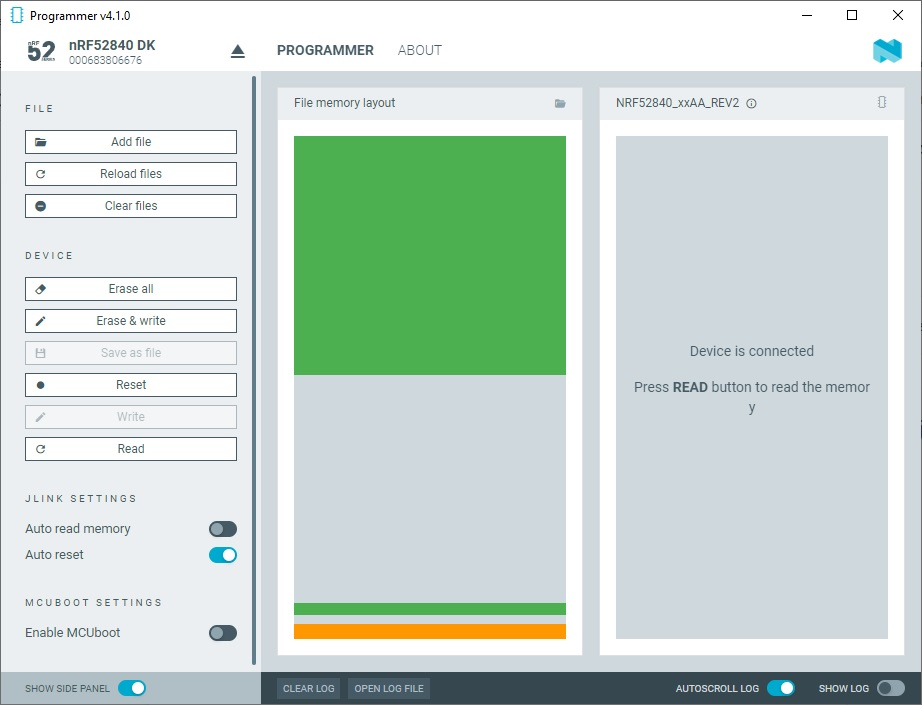
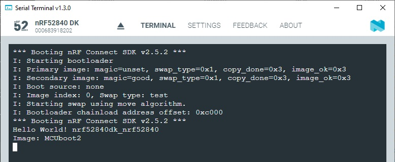

SDK version: NCS v2.5.2 - Link to Hands-on solution: [MCUboot1](https://github.com/ChrisKurz/MCUboot/tree/main/Workspace/NCSv2.5.2/01_MCUboot1), [MCUboot2](https://github.com/ChrisKurz/MCUboot/tree/main/Workspace/NCSv2.5.2/01_MCUboot2)

# MCUboot Hands-on:  Adding MCUboot to a Project

## Introduction

MCUboot takes care about the boot process. It handles the authentification of the application images and handles to copy the upgrade image to the slot, which is used to execute the code. Download of application image is handled within the application. 
So, first we will focus on the functionality of MCUboot only. We will do the firmware download by using the Programmer. Later on we will add this functionality also in the application software.

## Required Hardware/Software
- Development kit [nRF52840DK](https://www.nordicsemi.com/Products/Development-hardware/nRF52840-DK), [nRF52833DK](https://www.nordicsemi.com/Products/Development-hardware/nRF52833-DK), or [nRF52DK](https://www.nordicsemi.com/Products/Development-hardware/nrf52-dk)
- install the _nRF Connect SDK_ v2.5.2 and _Visual Studio Code_. The installation process is described [here](https://academy.nordicsemi.com/courses/nrf-connect-sdk-fundamentals/lessons/lesson-1-nrf-connect-sdk-introduction/topic/exercise-1-1/).

## Hands-on step-by-step description 

### Create first application (which will be replaced later by the firmware update)

1) Create a new application based on the /zephyr/samples/hello_world sample project. (e.g. name of new project: "01_MCUboot1")

2) Add the following line to main function:

	_src/main.c_ => main() function

           printf("Image: MCUboot1 \n");

   __Note:__ In previous hands-on we used the function __printk()__, which is included in the Zephyr kernel. In the Zephyr hello_world example the [PICOLIB](https://docs.nordicsemi.com/bundle/ncs-2.5.2/page/zephyr/develop/languages/c/picolibc.html) library is included. This library supports all standard C formatted input and output functions, like _printf()_. This is also the reason why _#include <stdio.h>_ is used in the code example.

3) Now we want to add MCUboot to our project. This is done using CONFIG_BOOTLOADER_MCUBOOT. If we set this CONFIG symbol to "y", a multi-image build is performed and the MCUboot project is added as a child image. 

	_prj.conf_

       CONFIG_BOOTLOADER_MCUBOOT=y

4) Build the project and take a look at the build/zephyr folder. Adding MCUboot and the associated activation of a multi-image build results in additional files being generated in the build/zephyr folder. The most important files are:

   - __zephyr.hex__: This file contains the image of the application project. In case of a multi-image build, several __zephyr.hex__ files are generated, one for each image. There is always a separate project behind each image.
   - __merged.hex__: The different zephyr.hex files of a multi-image build are merged together and stored in the __merged.hex__ file. So in our example the zephyr.hex files of the _01_MCUboot1_ project and the MCUboot project are merged. 
   - __app_signed.hex__: Signed variant of the application firmware. Note that the Intel Hex file (.hex) also defines the adddresses to store the image. The __app_signed.hex__ file uses slot 0 (slot that is used to execute the firmware image). So downloading this file would not trigger a DFU procedure. 
   - __app_moved_test_update.hex__: Same as __app_signed.hex__, but it includes metadata that instructs MCUboot to test this firmware upon boot. Moreover the image is placed into the slot 1 (slot that holds the upgrade image). When this file is programmed to the device, MCUboot will trigger the DFU procedure upon reboot.
   
   Further generated files are described [here](https://docs.nordicsemi.com/bundle/ncs-latest/page/nrf/config_and_build/configuring_app/output_build_files.html#common_output_build_files).

5) Start "Programmer" in nRF Connect for Desktop. 

6) Connect to your development kit. 

7) Click "Add File" and select in your project folder /build/zehpyr/merged.hex file.

8) In the Programmer you should see two blocks:

   

   The orange block at the bottom is the bootloader image. It is located at address 0x0000. Starting at address 0xC000 you find the green block, which is the _hello world_ application image. 

9) In the Programmer tool click "Earse all" and afterwards "Erase & write".

10) When programming is completed, check the Terminal output. 

   

   __Note__: The application is printing just once after a reset. So you have to press the Reset button on the development kit to see the output in the terminal window.

### Create second application (here we create the firmware update image)

11) Copy the __01_MCUboot1__ project and rename the copy to "01_MCUboot2". Erase the build folder in __01_MCUboot2__.

12) Add __01_MCUboot2__ to your Visual Studio Code workspace.

13) Open the file _main.c_ and change the line __printf("Image: MCUboot1 \n");__ to:

	_src/main.c_ => main() function

            printf("Image: MCUboot2 \n"); 

   __Note__: This change will allow us to recognize which image is running. The output "MCUboot2" means that the upgrade image is being executed.

14) Build the project. 

## Testing

### Following steps are done to test firmware udpate (we will download the upgrade image here via the programmer)

15) You should still see the orange and green block from project 01_MCUboot1 in the Programmer. Now click on "Add file" in the Programmer and select the file __01_MCUboot2/build/zephyr/app_moved_test_update.hex__. You should now see three software blocks in the Programmer tool. 

   

   We have now added the mcuboot2 application image. It is stored in the secondary slot. The reason why the complete secondary slot is now highlighted in the programmer is because the file __app_moved_test_update.hex__ also lists empty flash addresses and define the empty value 0xFF. 

   In the following steps, we emulate the firmware download that should be perfomred by the application software. We use the programmer here to load the firmware update image into the flash.

17) Ensure the Terminal is running

18) Click "Erase & Write" button.

19) Check the Terminal. In the Serial Terminal output check the "Swap type" and the application output that shows you which image is running ("Image: MCUboot1" or "Image: MCUboot2").

   

   We have loaded MCUboot1 image into primary slot (slot 0). So MCUboot1 should be executed. However, after completing the programming of the device a reset is done. This causes that the MCUboot is executed. MCUboot finds a new image (MCUboot2 firmware) in the secondary slot (slot 1). So it starts to swap the two images. If this is completed it executes the image that is stored in primary slot, which is now the MCUboot2 image.

   __NOTE__: In case you do not see this, you have most likely mixed up the main.c files of the MCUboot1 and MCUboot2 projects. So make sure that in MCUboot1 project the output is really "Image: MCUboot1", and for the MCUboot 2 project "Image: MCUboot2".

20) Reset the development kit by pressing its RESET button and see what happens...

   

   The swap type "test" is activated in the upgrade image of the MCUboot2 project. This means that the swap type "revert" is used after a swap. The Reset in this step has therefore resulted in the old image being written back to the primary slot. And then the old image (MCUboot1 project) is running again. 

   Each further Reset will run the orignial MCUboot1 image.
