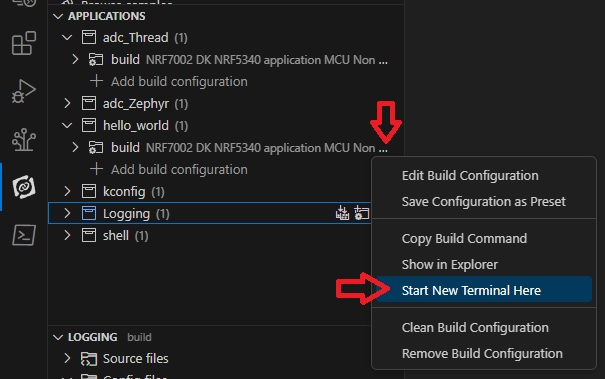
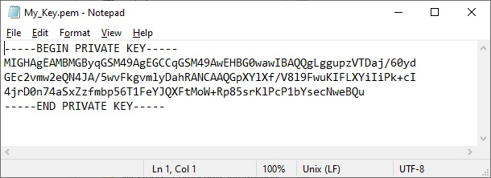

SDK version: NCS v2.5.2

# Generate a Key File

## Introduction 

MCUboot uses a signature for the application images. This means that each application image receives a signing key that is used to authenticate the image. This ensures that only authenticated software is executed.

In this hands-on we will look at the creation of a key file required for these purposes. 

## Required Software
- install the _nRF Connect SDK_ v2.5.2 and _Visual Studio Code_. The installation process is described [here](https://academy.nordicsemi.com/courses/nrf-connect-sdk-fundamentals/lessons/lesson-1-nrf-connect-sdk-introduction/topic/exercise-1-1/).

## Hands-on step-by-step description 

### Generate the key file
First, we generate a PEM file that contains a private/public key pair. The developers of MCUBoot provide a tool for image signing, image encryption, and key management. This tool is called __imgtool__. The __imgtool__ is included in the MCUBoot repository. This means that when you install the _nRF Connect SDK_, you also install MCUBoot and the __imgtool__ included in it. Note that __imgtool__ is a command line tool, which is executed in a command shell.

Note that the environmental variables on the computer has to be set to allow using __imgtool__. The easiest way is to open the terminal in Visual Studio Code by clicking on the three dots in the build 

## Generating a PEM file...

In general, there are different tools that help to create a PEM file. Here we will use __imgtool__.

The imgtool can be used to generate rsa-2048, rsa-3072, ecdsa-p256, ed25519, and x25519 keys. Here is the instruction:

    imgtool keygen -k <filename> -t <type> [-p]

|OPTIONS:|  |
|--|--|
| -k < filename > | This file will be generated and it contains the keypair. (example: -k my_key.pem) This key file is what is used to sign images. This file should be protected, and not distributed. |
| -p  | Adding this argument will cause to prompt for a password. You will need to enter this password every time you use the private key. No password is used in case you will not mention this argument. |
| -t < type >     | Key type. It should match the one for which mcuboot is configured. (example: -t rsa-2048) |

| Possible types are: | 
|--| 
| rsa-2048   | 
| rsa-3072   |
| ecdsa-p256 |
| ecdsa-p224 |
| ed25519    |
| x25519     |
 
Example:

Enter following line:

    imgtool keygen -k My_Key.pem -t ecdsa-p256

The file _My_Key.pem_ is created and it looks like this:

