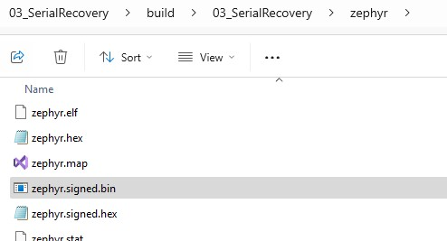

SDK version: NCS v2.9.0 - Link to Hands-on solution: [03_SerialRecovery](https://github.com/ChrisKurz/MCUboot/tree/main/Workspace/NCSv2.9.0/03_SerialRecovery)

# MCUboot Hands-on:  Adding Serial Recovery to the Project

## Introduction

## Required Hardware/Software
- Development kit [nRF54L15DK](https://www.nordicsemi.com/Products/Development-hardware/nRF54L15-DK), [nRF52840DK](https://www.nordicsemi.com/Products/Development-hardware/nRF52840-DK), [nRF52833DK](https://www.nordicsemi.com/Products/Development-hardware/nRF52833-DK), or [nRF52DK](https://www.nordicsemi.com/Products/Development-hardware/nrf52-dk)
- install the _nRF Connect SDK_ v2.9.0 and _Visual Studio Code_. The installation process is described [here](https://academy.nordicsemi.com/courses/nrf-connect-sdk-fundamentals/lessons/lesson-1-nrf-connect-sdk-introduction/topic/exercise-1-1/).

## Hands-on step-by-step description 

### Enable Serial Recovery in MCUboot

#### Use previous project as starting point

1) Let's make a copy of the previously used [01_mcuboot1](MCUboot1](https://github.com/ChrisKurz/MCUboot/tree/main/Workspace/NCSv2.8.0/01_MCUboot1) project. Name this project _03_SerialRecovery_.
  
   > **NOTE:** For this project we also select _use sysbuild_ for system build when adding the Build Configuration.

2) Rename the image title in the prinf() instruction:

	_sysbuild.conf_

           printf("Image: Serial Recovery, version 1\n");

### Enable and configure MCUboot ###

3) We have to use the __sysbuild.conf__ file for enabling MCUboot. Beside that we want to put the configuration of the MCUboot project in our own project folder. This is supported by creating a __sysbuild__ folder and placing a __mcuboot.conf__ file into it. Your project folder should then look like this:

    _Workspace folder_/03_SerialRecovery 
    |--- src 
    |--- |--- main.c 
    |--- CMakeLists.txt 
    |--- prj.conf 
    |--- sysbuild.conf 
    |--- sysbuild 
    |--- |--- mcuboot.conf

#### Enable MCUboot ####

4) MCUboot is added to the project by adding the file sysbuild.conf to the project folder (this is the folder where CMakeLists.txt file is located). Add following lines to the sysbuild.conf file:

	_sysbuild.conf_

       # Enable MCUboot
       SB_CONFIG_BOOTLOADER_MCUBOOT=y 

5) MCUboot's default setting is to use swap mode. This means that one slot is used for executing the application and a second slot is used to for storing the upgrade image. Since the serial recovery is not using a two-slot approache, we can configure MCUboot to work only with a single slot.

	_sysbuild.conf_

       # Configure bootloader to use only one slot
       SB_CONFIG_MCUBOOT_MODE_SINGLE_APP=y 

#### Enable MCUboot Logging ####

6) This step can be skipped, because the logging within MCUboot is activated by default. In case a custom board definition was used for your project. you should ensure that MCUboot logging is enabled. 
   
	_sysbuild/mcuboot.conf_

       CONFIG_LOG=y
       CONFIG_MCUBOOT_LOG_LEVEL_INF=y

#### Add Serial Recovery mode in MCUboot

6) Enable Serial Recovery by following KCONFIG setting in sysbuild/mcuboot.conf file.

	_sysbuild/mcuboot.conf_

       CONFIG_MCUBOOT_SERIAL=y
       CONFIG_BOOT_SERIAL_UART=y

7) Zephyr UART console must be disabled if Serial Recovery mode is used.

	_sysbuild/mcuboot.conf_

       CONFIG_UART_CONSOLE=n
 

8) MCUboot allows to indicate that MCUboot is in Serial Recovery mode via an LED. This feature can be enabled by setting following KCONFIG:

	_sysbuild/mcuboot.conf_

       CONFIG_MCUBOOT_INDICATION_LED=y

#### DeviceTree settings for MCUboot

8) Let's add an mcuboot.overlay file.
   
    _Workspace folder_/03_SerialRecovery 
    |--- src 
    |--- |--- main.c 
    |--- CMakeLists.txt 
    |--- prj.conf 
    |--- sysbuild.conf 
    |--- sysbuild 
    |--- |--- mcuboot.conf 
    |--- |--- mcuboot.overlay   

9) Define the button and LED that will be used. 

	_sysbuild/mcuboot.overlay_

       / {
         aliases {
                 mcuboot-button0 = &button1;
                 mcuboot-led0 = &led1;
                 };
         };
   

### Testing

10) Build and flash the project to your board.
11) Hold __button 2__ while resetting the development kit. The kit will now enter Serial Recovery mode. LED2 is indicating this mode. 

### Add DFU over UART to the application by using MCUMGR

12) Add MCUMGR software module by adding following lines to our prj.conf file.

	_sysbuild/mcuboot.conf_

        # Enable MCUMGR
        CONFIG_MCUMGR=y

        # Enable MCUMRG management for both OS and Images
        CONFIG_MCUMGR_GRP_OS=y
        CONFIG_MCUMGR_GRP_IMG=y

        # Configure MCUMGR transport to UART
        CONFIG_MCUMGR_TRANSPORT_UART=y

        # Dependencies:
        # Configure dependencies for CONFIG_MCUMGR
        CONFIG_NET_BUF=y
        CONFIG_ZCBOR=y
        CONFIG_CRC=y

        # Configure dependencies for CONFIG_MCUMGR_GRP_IMG
        CONFIG_FLASH=y
        CONFIG_IMG_MANAGER=y

        # Configure dependencies for CONFIG_IMG_MANAGER
        CONFIG_STREAM_FLASH=y
        CONFIG_FLASH_MAP=y
    
        # Configure dependencies for CONFIG_MCUMGR_TRANSPORT_UART
        CONFIG_BASE64=y

### Install MCUMGR on computer to allow image upload dev kit

13) The MCUMGR requires as dedicated software on the computer to handle image download. Such a dedicated software is for example the [mcumgr-cli](https://developer.nordicsemi.com/nRF_Connect_SDK/doc/latest/zephyr/services/device_mgmt/mcumgr.html#command-line-tool). You can install this with the following command line instruction, e.g. executed in Window's cmd.exe.

        go install github.com/apache/mynewt-mcumgr-cli/mcumgr@latest

> **NOTE**: You might have to install __Go__ to install __mcumgr-cli__. See [https://go.dev/doc/install](https://go.dev/doc/install) for how to install Go.

14) A test whether mcumgr is installed can be done as follows:

        mcumgr version
    
### Testing

14) We need a new application image for testing. Let's change the instruction __printf("Image: Serial Recovery, version 1\n");__ in main.c to:

        printf("Image: Serial Recovery, version 2\n");

   Build the project. You should find the binary file _zepyhr.signed.bin_ in the _build/03_SerialRecovery/zephyr_ folder.

   

   This is the signed binary file that uses the default signing key, which was also used in MCUboot project (because we have not changed the default signature settings in KCONFIG). So this file is the one we would like to download to our hardware.

15) Before we upload the new image, check the output in the terminal. You should see that "Image: Serial Recovery, version 1" is output in the Serial Terminal.

16) We have to add a configuration to mcumgr-cli tool, before we can use it. The configuration defines the UART settings.

        mcumgr conn add testDK type="serial" connstring="COM5,baud=115200,mtu=512"

   > **NOTE**: You should select the correct COM port, which is used on your computer for communication with the dev kit. A simple way to find out the COM port is using Serial Port and the used COM ports.

17) Get the dev kit into Bootloader mode. Press Button 2 and keep it holding, while you press for a short time the RESET button. The LED2 should be on after that, indicating that the board is in bootloader mode. 

18) Let's download the binary file to our hardware:

        mcumgr -c testDK image upload build/03_SerialRecovery/zephyr/zephyr.signed.bin

    You should then see a progress bar and a statement about how much of the code was already downloaded. The code download is complete as soon as "Done" is shown.

19) Reset the dev kit by either pressing the RESET button on the DK or by executing following instruction:

        mcumgr -c testDK reset

20) You should now see that the output string has changed to "Image: Serial Recovery, version 2". So MCUboot has copied the image we stored in slot 1 into slot 0, where it is now executed.
